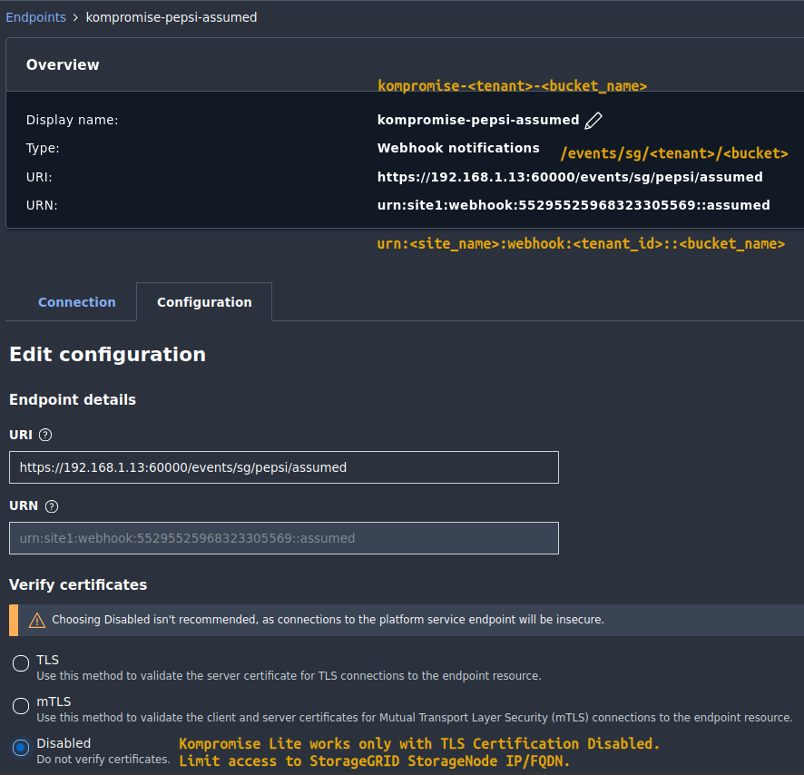

# Kompromise Webhook Lite

Kompromise Webhook Lite is a simplified version of Kompromise Webhook from the broader and more complex Kompromise stack (which requires Kubernetes and contains several additional components).

Kompromise Lite is meant to provide a limited, but useful, tool for agentic, analytics and other use cases for which upstream has no specific examples.

The features of Kompromise Lite edition are similar to Simple notifications from Kompromise:

- StorageGRID notifications -> credential-free Simple+ webhook -> Vector.
- Two containers, three configuration files, no Kubernetes or S3 keys required.
- Console output for inspection and an optional Kafka sink (provided here because full Kompromise stack defaults to NATS). Downstream consumers process notifications into their destination's document format.

## Simple+ JSON

This is the outgoing event: console output and Kafka values have the same format as Simple+ NATS messages in the main stack. Vector removes the webhook's stdout wrapper before forwarding.

```json
{
  "Records": [
    {
      "eventVersion": "2.0",
      "eventSource": "sgws:s3",
      "eventTime": "2026-10-05T10:00:00Z",
      "eventName": "ObjectCreated:Put",
      "s3": {
        "bucket": { "name": "images" },
        "object": { "key": "example.txt", "size": 123, "sequencer": "18D8F0C7187D2A5C" }
      }
    }
  ],
  "kompromise": {
    "mode": "simple",
    "pipeline": "simple",
    "source": "sgws",
    "tenant": "demo",
    "bucket": "images",
    "received_at": "2026-10-05T10:00:01.123456789Z",
    "enriched_at": "2026-10-05T10:00:01.123567890Z"
  }
}
```

- `Records` fields are preserved, including StorageGRID's coarse `eventTime`.
- `Records[].s3.object.sequencer` is preserved too: compare its hexadecimal value only for events concerning the same bucket and object key, not across buckets. It helps order out-of-order deliveries independently of the coarse timestamps. The schema keeps it optional for sources or events that do not supply it.
- `received_at` is when the webhook starts reading the request; `enriched_at` is when it finishes adding metadata, before output serialization. Both are UTC. Neither timestamp is the precise object PUT time. No S3 enrichment occurs.

### JSON Schema

The envelope schema leaves record contents open to preserve backend-specific fields. It describes Simple+ output, not validation of incoming notifications.

```json
{
  "$schema": "https://json-schema.org/draft/2020-12/schema",
  "title": "Kompromise Simple+ Notification",
  "type": "object",
  "required": ["Records", "kompromise"],
  "properties": {
    "Records": {
      "type": "array",
      "minItems": 1,
      "items": {
        "type": "object",
        "additionalProperties": true,
        "properties": {
          "s3": {
            "type": "object",
            "properties": {
              "object": {
                "type": "object",
                "properties": {
                  "sequencer": { "type": "string", "pattern": "^[0-9a-fA-F]+$" }
                }
              }
            }
          }
        }
      }
    },
    "kompromise": {
      "type": "object",
      "required": ["mode", "pipeline", "source", "tenant", "bucket", "received_at", "enriched_at"],
      "properties": {
        "mode": { "const": "simple" },
        "pipeline": { "type": "string" },
        "source": { "enum": ["sgws", "vgw"] },
        "tenant": { "type": "string" },
        "bucket": { "type": "string" },
        "received_at": { "type": "string", "format": "date-time" },
        "enriched_at": { "type": "string", "format": "date-time" }
      }
    }
  }
}
```

## Run

Requires Docker Compose v2 on Linux. From the repository root:

1. Edit [deploy/lite/webhook.yaml](deploy/lite/webhook.yaml): set `tenant` and `bucket`.
2. Optionally uncomment Kafka in [deploy/lite/vector.yaml](deploy/lite/vector.yaml) and configure the destination and authentication. Console output is enabled by default.
3. Build own Webhook image from a file in Releases (x86 or ARM64) or use mine from Docker Hub (replace Webhook image in `docker-compose-lite.yaml` with `scaleoutsean/kompromise-webhook:lite-0.1.0-faba361`).
4. Build and start with [docker-compose-lite.yaml](docker-compose-lite.yaml):

```sh
docker compose -f docker-compose-lite.yaml up -d --build
curl -f http://127.0.0.1:8080/healthz
# Suggested convention: /events/sg/<tenant>/<bucket>
curl -f http://127.0.0.1:8080/events/sg/demo/images \
  -H 'Content-Type: application/json' \
  --data '{"Records":[{"eventName":"ObjectCreated:Put","s3":{"bucket":{"name":"images"},"object":{"key":"example.txt","sequencer":"18D8F0C7187D2A5C"}}}]}'
docker compose -f docker-compose-lite.yaml logs --no-log-prefix vector
```

Defaults to localhost. Set `WEBHOOK_BIND_IP=<host-ip>` and optionally `WEBHOOK_PORT=<port>` when starting Compose to expose it to StorageGRID. The notification endpoint is `http://<host>:<port>/events/sg/<tenant>/<bucket>`; `tenant` is a routing label, not authentication.

Restrict network access to StorageGRID storage nodes; provide your own TLS/authentication if needed. Vector's Docker socket access is privileged even though its bind mount is read-only.

## Scope

Lite forwards notifications only. Each enabled Vector sink has a persistent ~256 MiB disk buffer with `drop_newest`: new events are lost when that buffer fills. HTTP 200 means written to stdout, not delivered downstream. This is *not* zero-loss; for zero-loss, send notifications Kafka or Kompromise Full (where Simple notifications are zero-loss and use the included NATS cluster, which is much easier to manage).

`docker compose -f docker-compose-lite.yaml down` keeps on-disk buffers. Use `down -v` to delete them.

Kompromise Lite has no rich S3 enrichment, audit-log bridge, any gap coverage, S3 caching, or object-state index maintenance. Indexing belongs in a separate downstream consumer, not in this stack.

## Tips

Enable bucket versioning for buckets with notifications and optionaly add ILM to expire non-current versions any time (and you may want to remember to remove non-current versions from downstream indexes).

Find retrieve the referenced version when processing must match a specific event. 

If you overwrite objects, space out object overwrites (e.g. 10s) to decrease the likelihood of out-of-order notifications from StorageGRID. 

Limit access to Webhook (or its gateway) IP/FQDN to StorageGRID storage nodes (all storage nodes, because notifications can come from any site) unless you come up with additional security controls on your own.

Simple+ doesn't capture rich object metadata like full Kompromise does, so tags and metadata may not be captured. A workaround - if you need that detail - is to fetch them as you process notifications exit from Kafka (full Kompromise does something similar in Rich notifications). A downside is your client may crash or time out after receiving Kafka notification, leaving you with nothing (no index entry, no tags either, and Kafka has delivered the notification once).

## Webhook notification 

Unless you configure your own mTLS or TLS (by adding an API gateway or reverse proxy in front of Kompromise Lite), set TLS validation to `Disabled` *unless* you have set up a proxy or gateway in front of Webhook to make TLS or mTLS work.



Suggested conventions:
- Display name: `kompromise-<tenant>-<bucket_name>`
- URI: HTTP or HTTPS host and port of your choosing with `/events/sg/<tenant>/<bucket>`
- URN: `urn:<storagegrid_site>:webhook:<tenant_id>::<bucket_name>`

StorageGRID does not allow major edits to Webhook configuration, so while you may need to delete an HTTP notification to recreate it with HTTPS and TLS or mTLS validation, for an example, it is useful to have one naming convention for all Webhook configurations.

## Additional information

Read the StorageGRID documentation to learn about its configuration, workings and limitations.

Kompromise Lite is not expected to receive significant feature updates. Broader integrations and planned features belong to the main Kompromise project.

## Terms of use and privacy

Kompromise Lite is free to use.

Kompromise Lite does not collect any telemetry, does not require any StorageGRID S3 or tenant login credentials, and does not "phone home".

## License

- CC BY 4.0 for repository documentation and other content
